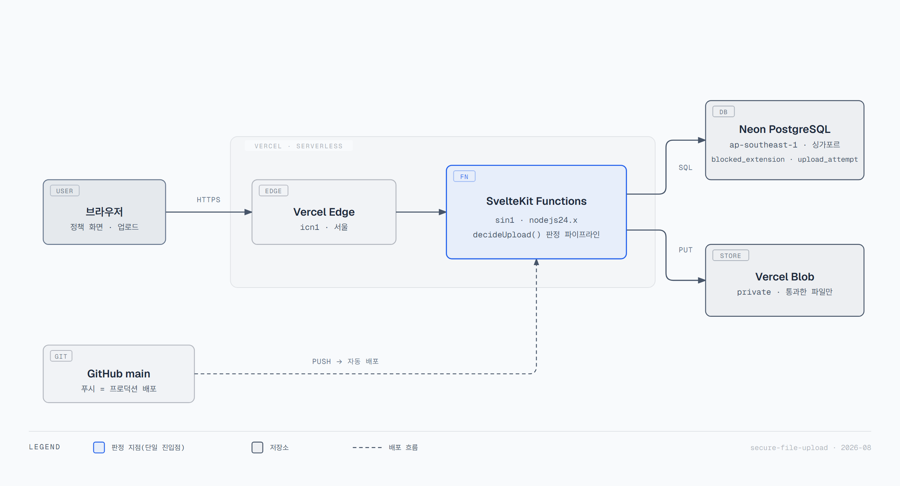
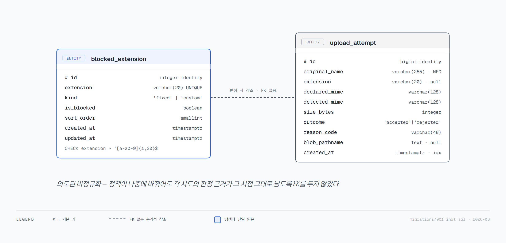
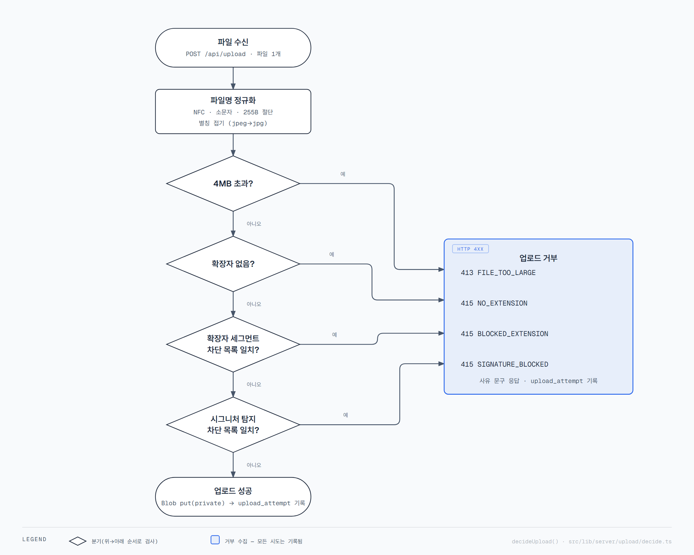

# 🛡 flow-assignment - 확장자 차단 정책 관리 + 서버 사이드 업로드 검증 웹 애플리케이션

> **"차단 목록은 화면에만 있으면 안 됩니다. 서버가 막아야 정책입니다."**
> <br/>

[🌐 서비스 바로가기 (flow-assignment-opal.vercel.app)](https://flow-assignment-opal.vercel.app)

  <p align="center">
    
    
    
    
    
  </p>

<br/>

## 🚀 프로젝트 소개

파일 업로드에 적용할 **확장자 차단 정책**을 DB에 저장·관리하고, 그 정책을 실제 업로드 요청에서 **서버가 강제**하는 단일 배포 웹 애플리케이션입니다. 고정 확장자 7개(`bat` `cmd` `com` `cpl` `exe` `scr` `js`)를 체크박스로 켜고 끌 수 있고, 커스텀 확장자를 최대 200개까지 20자 이하로 추가·삭제할 수 있습니다. 변경은 즉시 DB에 반영되어 새로고침 후에도 유지됩니다.

정책 화면만 있고 업로드에서 강제되지 않으면 "정책은 있으나 막지 못하는 화면"에 그칩니다. 그래서 정책 관리와 업로드 강제를 하나의 신뢰 경계 안에 두었습니다. 파일명 확장자뿐 아니라 파일 **내용의 매직 넘버**까지 확인하고, 무엇이 왜 막혔는지를 사유 코드와 함께 돌려줍니다. 브라우저가 보여 주는 차단 안내는 편의용 힌트일 뿐이며 어떤 판정에도 입력으로 쓰이지 않습니다.

- **개발 기간:** 2026.08.29 ~ 2026.08.31 (과제)
- **담당 역할:** 1인 풀스택 기획/개발/배포, AI 협업 개발

<br/>

## 🔒 열람 안내 (For Interviewers)

**이 과제의 핵심은 "서버가 유일한 강제 지점"이라는 설계와, 그 판정 로직의 정확성입니다. 아래 파일을 중점적으로 검토해 주시면 감사하겠습니다.**

- **`src/lib/server/upload/`** — 판정 파이프라인 전체. `decide.ts`(판정 단일 진입점), `extension.ts`(파일명 정규화·확장자 후보 추출·별칭 표), `signature.ts`(매직 넘버 + prefix 스니핑), `reason-codes.ts`(사유 코드 ↔ 상태 코드 ↔ 문구 매핑)
- **`src/routes/api/upload/+server.ts`** — 서버 사이드 강제가 실제로 일어나는 유일한 엔드포인트
- **`migrations/001_init.sql`** — DDL 단일 원본
- **`CONSIDERATIONS.md`** — 과제 §3의 19개 고려사항 + 자체 발굴 9개, 총 28항목의 판단과 근거
- **`PROMPT_LOG.md`** — AI 활용 기록 (프롬프트 타임라인, 사용 도구, 채택/수정/폐기 회고)

<br/>

## 🛠 기술 스택

- **Frontend:** Svelte 5 (runes 모드), SvelteKit 2, TypeScript 6
- **Backend:** SvelteKit 서버 라우트 (Vercel Functions), `@sveltejs/adapter-vercel` 6
- **Database:** Neon PostgreSQL, `@neondatabase/serverless` 1.1 (HTTP 드라이버), 자체 마이그레이션 러너
- **Storage:** Vercel Blob 2.8 (private access)
- **Validation:** `file-type` 22 (매직 넘버 판별) + 자체 prefix 스니핑
- **Testing:** Vitest 4, `@electric-sql/pglite` 0.5 (인프로세스 PostgreSQL 통합 테스트), `@testing-library/svelte` (jsdom 컴포넌트 테스트)
- **Infra & DevOps:** Vercel (GitHub 연결 자동 배포), pnpm, ESLint 10 + Prettier 3

<br/>

## 🏗 시스템 아키텍처

<p align="center">
  
</p>

브라우저가 파일을 `POST /api/upload`로 보내면, Vercel Functions 위에서 도는 SvelteKit 서버 라우트가 요청을 받습니다. 요청마다 `hooks.server.ts`가 Neon HTTP 클라이언트와 Vercel Blob 스토어를 `locals`에 주입하고, 엔드포인트는 Neon에서 현재 차단 정책을 읽어 판정한 뒤, 통과한 파일만 Vercel Blob(private)에 `uploads/{UUID}` 키로 저장하고 판정 결과 1행을 Neon의 `upload_attempt`에 기록합니다. Neon HTTP 드라이버를 쓰는 이유는 서버리스 함수마다 커넥션 풀을 새로 여는 비용을 피하기 위해서입니다. Blob은 private이라 URL만으로는 열리지 않으며, 업로드된 파일을 다시 내려주는 엔드포인트는 의도적으로 만들지 않았습니다.

<br/>

## 💾 데이터베이스 스키마 (ERD)

DDL의 단일 원본은 [`migrations/001_init.sql`](./migrations/001_init.sql)입니다. 아래 표는 그 파일을 읽기 쉽게 옮긴 것이며, 둘이 어긋나면 SQL 파일이 맞습니다.

<p align="center">
  
</p>

### `blocked_extension` — 확장자 차단 정책

고정 확장자와 커스텀 확장자를 `kind` 컬럼으로 구분해 **한 테이블에** 담습니다. 테이블을 둘로 나누면 "고정과 커스텀이 같은 확장자를 가질 수 있는가"라는 질문에 DB가 답하지 못하는데, 하나로 두면 `UNIQUE(extension)` 제약 하나가 그 답을 강제합니다.

| 컬럼 | 타입 | 제약 |
|---|---|---|
| `id` | `integer` | `GENERATED ALWAYS AS IDENTITY`, `PRIMARY KEY` |
| `extension` | `varchar(20)` | `NOT NULL`, `UNIQUE` (`blocked_extension_extension_key`), `CHECK (extension ~ '^[a-z0-9]{1,20}$')` (`blocked_extension_format_check`) |
| `kind` | `text` | `NOT NULL`, `CHECK (kind IN ('fixed', 'custom'))` (`blocked_extension_kind_check`) |
| `is_blocked` | `boolean` | `NOT NULL`, `DEFAULT false` |
| `sort_order` | `smallint` | `NOT NULL`, `DEFAULT 0` |
| `created_at` | `timestamptz` | `NOT NULL`, `DEFAULT now()` |
| `updated_at` | `timestamptz` | `NOT NULL`, `DEFAULT now()` |

**인덱스:** `PRIMARY KEY (id)`와 `UNIQUE (extension)` 두 개뿐입니다. 행 수 상한이 207개(고정 7 + 커스텀 200)라 추가 인덱스는 조회를 빠르게 하지 못하고 쓰기 비용만 늘립니다.

**시드 데이터:** 고정 확장자 7개를 `kind = 'fixed'`, `is_blocked = false`(기본 unCheck), `sort_order = 1..7`로 넣습니다. `ON CONFLICT DO NOTHING`이라 재실행해도 중복되지 않습니다.

### `upload_attempt` — 업로드 시도 감사 기록

| 컬럼 | 타입 | 제약 |
|---|---|---|
| `id` | `bigint` | `GENERATED ALWAYS AS IDENTITY`, `PRIMARY KEY` |
| `original_name` | `varchar(255)` | `NOT NULL` — 표시·감사용 **정규화** 파일명(클라이언트가 보낸 원본 바이트가 아님) |
| `extension` | `varchar(20)` | NULL 허용 — 마지막 dot-segment 1개 |
| `declared_mime` | `varchar(128)` | NULL 허용 — 브라우저가 신고한 MIME (판정에는 미사용, 기록만) |
| `detected_mime` | `varchar(128)` | NULL 허용 — 파일 내용에서 판별한 MIME |
| `size_bytes` | `integer` | `NOT NULL` |
| `outcome` | `text` | `NOT NULL`, `CHECK (outcome IN ('accepted', 'rejected'))` (`upload_attempt_outcome_check`) |
| `reason_code` | `varchar(48)` | NULL 허용 — 거부일 때의 사유 코드 |
| `blob_pathname` | `text` | NULL 허용 — 수락일 때의 저장 키 (`uploads/{UUID}`) |
| `created_at` | `timestamptz` | `NOT NULL`, `DEFAULT now()` |

**인덱스:** `PRIMARY KEY (id)` + `upload_attempt_created_at_idx ON upload_attempt (created_at DESC)` — 감사 기록은 항상 최신순으로 읽습니다.

파일 **내용**은 이 테이블에도, 구조화 로그에도 남기지 않습니다.

### `_migration` — 마이그레이션 적용 이력

`001_init.sql`이 아니라 [`scripts/migrate.ts`](./scripts/migrate.ts)가 실행 시점에 만드는 부기용 테이블입니다.

| 컬럼 | 타입 | 제약 |
|---|---|---|
| `filename` | `text` | `PRIMARY KEY` |
| `applied_at` | `timestamptz` | `NOT NULL`, `DEFAULT now()` |

<br/>

## 🔄 업로드 판정 흐름

<p align="center">
  
</p>

요청 하나는 파일 하나를 싣습니다. 아래 8단계는 `src/routes/api/upload/+server.ts`의 `POST` 핸들러와 `src/lib/server/upload/decide.ts`의 `decideUpload()`가 실제로 실행하는 순서입니다.

1. **`Content-Length` 선차단** — 헤더가 4MB를 넘으면 본문을 읽기 전에 `FILE_TOO_LARGE`(413). 이 시점에는 파일명·실제 크기가 확정되지 않아 DB 행 없이 구조화 로그만 남깁니다.
2. **`formData()` 파싱** — 멀티파트에서 파일을 꺼냅니다. 파일이 없으면 400.
3. **크기 실측 재확인** — 헤더가 없거나 허위로 신고된 경우를 위한 두 번째 겹. 실측 `file.size`가 4MB를 넘으면 `FILE_TOO_LARGE`(413), 이번에는 DB에 1행을 남깁니다.
4. **파일명 정규화** — NFC → 제어문자 제거 → 경로 구분자 제거 → `..` 제거 → 255바이트 절단(`normalizeFilename`).
5. **확장자 후보 추출** — 소문자화 후 `.`로 분해, 첫 세그먼트를 제외한 **모든** dot-segment를 후보로 잡고 별칭 대표형으로 접습니다(`extractExtensionSegments`). 후보가 하나도 없으면 `NO_EXTENSION`(415).
6. **정책 대조** — Neon에서 읽은 차단 목록과 후보를 맞춰 봅니다. 하나라도 걸리면 `BLOCKED_EXTENSION`(415)이며, 실제로 걸린 대표형을 `details.matched`에 담아 알려 줍니다.
7. **시그니처 대조** — 앞 4100바이트를 읽어 매직 넘버와 선행 텍스트를 판별합니다(`sniffSignature`). 판별된 확장자가 차단 목록에 있을 때만 `SIGNATURE_BLOCKED`(415)로 거부합니다. **단순 불일치는 거부하지 않습니다** — `mismatch` 플래그로 기록만 합니다.
8. **저장과 기록** — 통과하면 `uploads/{UUID}` 키로 Blob에 저장(원본 파일명·확장자를 키에 쓰지 않음)한 뒤 `upload_attempt`에 1행을 남깁니다.

<br/>

## 🔥 핵심 트러블슈팅 및 설계 결정 (Key Engineering Decisions)

> 💡 **판단의 전체 근거 28항목은 [`CONSIDERATIONS.md`](./CONSIDERATIONS.md)에 있습니다. 여기서는 특히 손이 많이 간 4건만 추렸습니다.**

### 1. 확장자·시그니처 2중 판정과 별칭 표 단일 원본

**문제.** 확장자는 사용자가 마음대로 바꿀 수 있는 문자열이라, 이름만 봐서는 `report.jpg`로 위장한 실행 파일을 막을 수 없습니다. 그렇다고 내용 판별 결과와 확장자가 다르다는 이유만으로 거부하면 반대쪽이 무너집니다. `docx`처럼 zip으로 판별되는 컨테이너 포맷과 텍스트 포맷에서 오탐이 쏟아지고, 사용자는 차단 메시지 자체를 믿지 않게 됩니다.

**해결.** 판별 결과는 차단 목록과 대조될 때만 거부 근거로 삼고(`decideUpload` 4단계), 단순 불일치는 `mismatch` 플래그로 기록만 남깁니다. 별칭 표(`jpeg`→`jpg` 등)는 `EXTENSION_ALIASES` 하나만 두고, 파일명 후보 추출과 시그니처 판별과 정책 저장이 모두 같은 표를 참조하도록 `@MX:ANCHOR`로 고정했습니다.

**결과.** `jpg`를 차단하면 `photo.jpeg`도 `matched: "jpg"`로 막히고, 정상 JPEG는 오거부되지 않습니다. 표가 갈라져 한쪽만 고쳐지는 순간 오탐이 조용히 돌아오는 구조적 위험도 함께 사라졌습니다.

### 2. 커스텀 확장자 200개 상한을 단일 원자 SQL로

**문제.** "세어 보고 200 미만이면 INSERT"라는 두 단계 구현은 경합에 열려 있습니다. 동시 요청 두 건이 199개를 함께 읽으면 둘 다 삽입에 성공해 201개가 됩니다.

**해결.** 카운트와 삽입을 조건부 INSERT를 담은 하나의 CTE로 묶어 왕복 1회, 원자 1연산으로 처리했습니다(`policy-repo.ts`의 `addCustom()`). 고정 확장자와의 충돌은 `UNIQUE(extension)` 제약이 마지막 방어선을 맡습니다.

**결과.** 애플리케이션 검사와 DB 제약이 이중으로 걸려 있어, 새 코드 경로가 생겨도 상한이 뚫리지 않습니다. READ COMMITTED에서 완전히 닫히지는 않는 잔여 경합은 `@MX:WARN`으로 코드에 명시해 두었습니다.

### 3. 정책 화면 낙관적 갱신과 "서버가 준 값으로" 롤백

**문제.** 체크박스를 낙관적으로 먼저 바꾸고 실패하면 직전 로컬 상태로 되돌리는 흔한 구현에는 함정이 있습니다. 그 사이 다른 탭에서 정책이 바뀌었다면, 롤백이 화면을 더 낡은 값으로 되돌려 놓습니다.

**해결.** 정책 변경 엔드포인트가 변경 후의 정식 정책 상태를 응답에 함께 돌려주고, 화면은 실패 시 그 값으로 재조정합니다(`FixedExtensionList.svelte`). "서버가 진실"이라는 원칙을 롤백 경로에까지 관철한 것입니다.

**결과.** 저장에 실패해도 화면과 DB가 반드시 수렴합니다. 이 롤백 과도 상태는 jsdom 컴포넌트 테스트로 직접 검증했습니다(AC-UPLOAD-016a).

### 4. 제로 트러스트 시크릿 취급 — 그리고 실제로 한 번 새어 나갔을 때

**문제.** 2026년 4월 Vercel 공급망 사고 이후, 시크릿은 명령어 문자열에도 셸 히스토리에도 AI 세션에도 남지 않아야 합니다. 그런데 문서로만 정한 규칙은 급할 때 지켜지지 않습니다.

**해결.** 애플리케이션은 `$env/dynamic/private`로만 시크릿을 읽고, Vercel 변수는 대화형 `vercel env add`로만 등록하며 전부 Sensitive로 둡니다. 이 규칙을 훅으로 기계 강제해(`block-env-edit.mjs`, `block-vercel-env-insecure.mjs`) `--value` 옵션, 파이프 입력, `vercel env pull`을 아예 거부하게 만들었습니다.

**결과.** 실제로 연결 문자열이 AI 채팅에 한 번 노출되는 사고가 있었는데, AI가 그 값의 사용을 거부하고 즉시 교체를 권고해 `neondb_owner` 비밀번호를 재설정했습니다. 현재 모든 값은 교체 후의 값입니다. 이 과정에서 테스트가 `.env`를 자동으로 읽고 있던 문제도 발견해 `$env/dynamic/private` 모킹으로 격리했습니다(자세한 경위는 `CONSIDERATIONS.md` E5).

<br/>

## 🚀 로컬 실행 및 테스트 안내

Node **24 이상**과 **pnpm**이 필요합니다(마이그레이션 스크립트가 `node --env-file-if-exists` 옵션을 사용합니다).

```bash
# 1. 의존성 설치
pnpm install

# 2. 환경 변수 파일 준비 — .env.example을 복사한 뒤 값을 직접 입력합니다.
cp .env.example .env
#    편집기로 .env 를 열어 DATABASE_URL 과 BLOB_READ_WRITE_TOKEN 을 채웁니다.
#    .env 는 .gitignore 대상이며 커밋되지 않습니다.

# 3. 데이터베이스 마이그레이션 (테이블 생성 + 고정 확장자 7개 시드)
pnpm db:migrate

# 4. 개발 서버 실행 → http://localhost:5173
pnpm dev
```

`pnpm db:migrate`는 `migrations/`의 `.sql` 파일을 파일명 순서대로 적용하고 이력을 `_migration`에 남깁니다. 이미 적용된 파일은 건너뛰므로 여러 번 실행해도 안전합니다.

| 명령 | 하는 일 |
|---|---|
| `pnpm test` | 전체 테스트 (Vitest — `node` 프로젝트 + `jsdom` 컴포넌트 프로젝트) |
| `pnpm test:coverage` | 커버리지 측정 (`src/lib/server/**` 기준) |
| `pnpm lint` | `prettier --check` + `eslint` |
| `pnpm check` | `svelte-check` 타입 검사 |
| `pnpm build` | 프로덕션 빌드 (adapter-vercel) |

테스트는 실제 Neon·Vercel Blob에 접속하지 않습니다. DB가 필요한 테스트는 PGlite(WASM PostgreSQL)에 같은 `migrations/001_init.sql`을 적용해 인프로세스로 돌리고, 환경 변수에 의존하는 테스트는 `$env/dynamic/private` 모듈 자체를 모킹합니다. `.env`가 있든 없든 결과가 같습니다.

### 환경 변수

값은 저장소에 두지 않습니다. 이름과 용도만 적고, 실제 값은 로컬 `.env`(추적 제외)와 Vercel 프로젝트 설정에만 존재합니다.

| 이름 | 용도 | 발급처 |
|---|---|---|
| `DATABASE_URL` | Neon PostgreSQL 연결 문자열. `scripts/migrate.ts`와 런타임 DB 클라이언트가 사용합니다. | [Neon 콘솔](https://console.neon.tech) → 프로젝트 → Connection string |
| `BLOB_READ_WRITE_TOKEN` | Vercel Blob 읽기/쓰기 토큰. 업로드된 파일을 private 저장소에 올릴 때 사용합니다. | Vercel 대시보드 → Storage → Blob 스토어 → Tokens |

애플리케이션 코드는 이 값들을 **`$env/dynamic/private`로만** 읽습니다. `process.env` 직접 접근은 SvelteKit 밖에서 도는 `scripts/`에만 허용합니다. `PUBLIC_` 접두사를 쓰지 않으므로 클라이언트 번들에 유입될 경로가 없습니다.

### 배포

배포 대상은 Vercel이며 GitHub 저장소가 연결되어 있습니다. **`main`에 push하면 프로덕션 배포가 자동으로 시작됩니다.** 별도의 배포 명령이 필요 없습니다.

시크릿 등록은 운영자가 직접, 최초 1회 수행합니다. 이 프로젝트는 [`.claude/rules/local/secret-management.md`](./.claude/rules/local/secret-management.md)의 zero-trust 규칙을 따릅니다(근거: 2026년 4월 Vercel 공급망 사고).

```bash
# 명령을 실행하면 값을 묻는 대화형 프롬프트가 뜹니다.
# 실제 값(.env에서 `=` 오른쪽 부분)은 그 프롬프트에 붙여 넣습니다.
vercel env add DATABASE_URL production
vercel env add BLOB_READ_WRITE_TOKEN production
```

- 금지되는 것은 **명령어 줄 자체에 값을 쓰는 형태**입니다 — `--value`로 값을 넘기거나 `echo VALUE | vercel env add ...`로 파이프하면 셸 히스토리와 CI 로그에 평문이 남습니다. 대화형 프롬프트에 실제 값을 입력하는 것은 올바른(그리고 유일한) 방법입니다.
- Production·Preview 변수는 **모두 Sensitive**로 둡니다. CLI 기본값이 sensitive이므로 `--no-sensitive`를 붙이지 않으면 됩니다. Sensitive 변수는 대시보드·`vercel env ls`·API로 되읽을 수 없습니다.
- Development 타깃은 sensitive로 만들 수 없으므로 **로컬 개발용 값은 Vercel에 등록하지 않고** 추적되지 않는 `.env`에 직접 타이핑합니다.
- `.vercel/` 디렉터리는 커밋하지 않습니다.

> **주의:** [`src/hooks.server.ts`](./src/hooks.server.ts)가 매 요청마다 DB 클라이언트와 Blob 스토어를 만듭니다. 두 환경 변수 중 **하나라도 비어 있으면 모든 요청이 500**입니다. 의도된 fail-closed 동작으로, 시크릿이 빠진 채 정책이 무력화된 상태로 서비스되는 것보다 낫습니다. 배포 전 Vercel 대시보드에서 두 변수가 Production 스코프·Sensitive 배지로 존재하는지, Neon에 마이그레이션이 적용됐는지 확인해 주세요.

<br/>

## 📚 문서

| 파일 | 내용 |
|---|---|
| [`PROMPT_LOG.md`](./PROMPT_LOG.md) | AI 활용 기록 — 프롬프트 타임라인, 사용한 스킬·에이전트·라이브러리, 채택/수정/폐기 판단 회고 |
| [`CONSIDERATIONS.md`](./CONSIDERATIONS.md) | 과제 §3의 19개 고려사항 + 자체 발굴 9개, 총 28항목의 판단과 근거 |
| `.moai/specs/SPEC-UPLOAD-001/` | 요구사항 16개(GEARS) · 설계 결정과 마일스톤 · 인수 기준 16개와 품질 게이트 12개 · 마일스톤별 실행 증거 |
